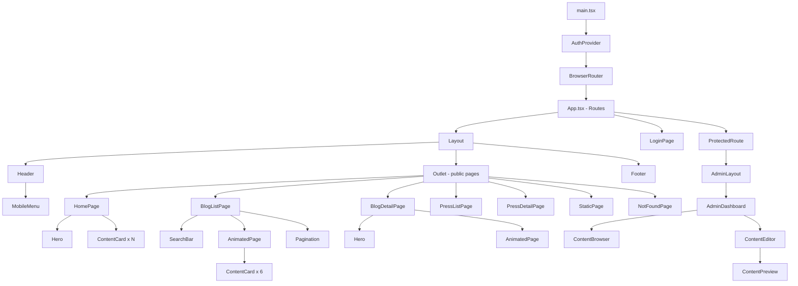
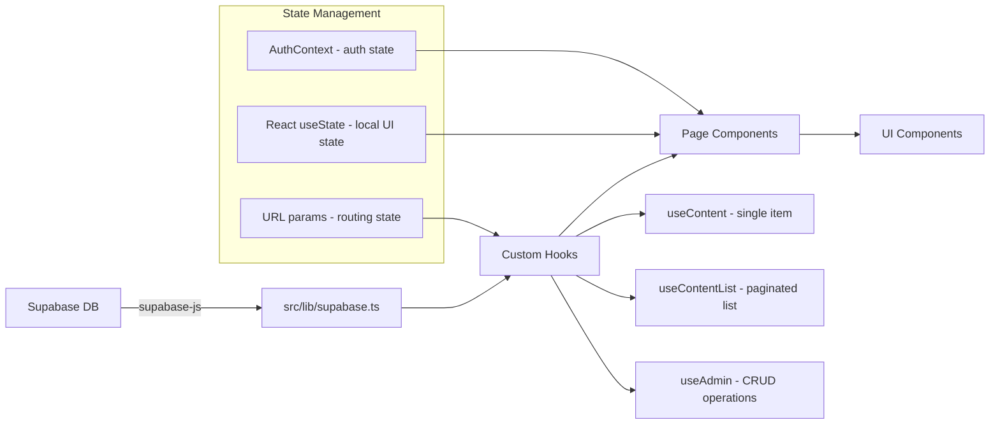
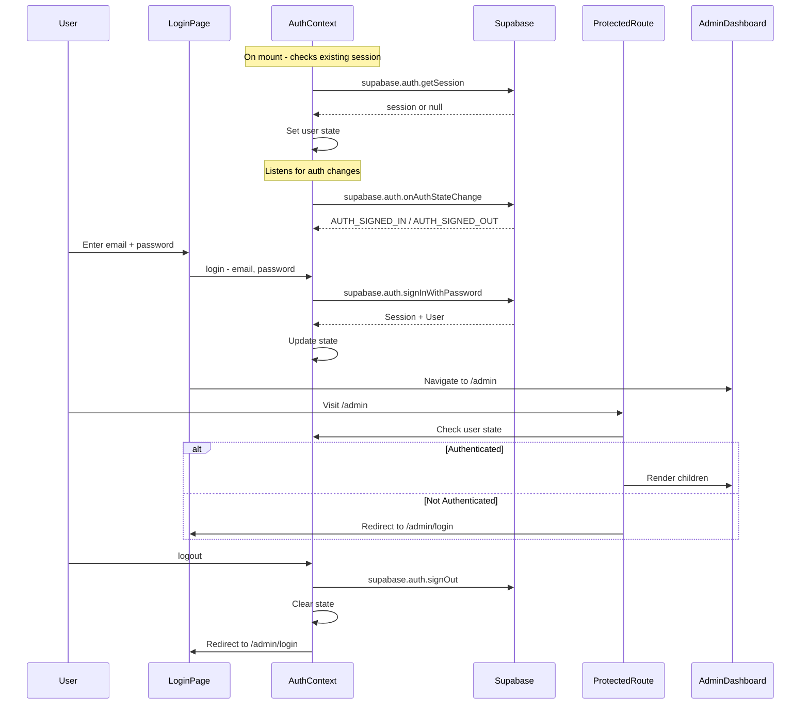

# Lumina Press — Architecture Document

> **Blueprint for a production-ready digital media site built with Vite + React + TypeScript + Supabase**

---

## Table of Contents

1. [Project Overview](#1-project-overview)
2. [File & Folder Structure](#2-file--folder-structure)
3. [Component Hierarchy](#3-component-hierarchy)
4. [Route Configuration](#4-route-configuration)
5. [Data Flow](#5-data-flow)
6. [Auth Flow](#6-auth-flow)
7. [Type Definitions](#7-type-definitions)
8. [Supabase SQL](#8-supabase-sql)
9. [Styling Approach](#9-styling-approach)
10. [Prerequisites & Setup](#10-prerequisites--setup)

---

## 1. Project Overview

Lumina Press is a slug-based digital media site with three content types — **Blog**, **Press Releases**, and **Static Pages** — all stored in a single Supabase `contents` table. It features a public-facing site with dark cinematic aesthetics and a protected admin dashboard for full CRUD operations.

### Tech Stack

| Layer | Technology |
|-------|-----------|
| Build | Vite 5 |
| UI | React 18 + TypeScript 5 |
| Routing | react-router-dom v6 |
| Database & Auth | Supabase (supabase-js v2) |
| Animations | Framer Motion v11 |
| Icons | Lucide React |
| Styling | Tailwind CSS v3 |

### Existing Configuration

- Supabase client: `src/lib/supabase.ts`
- Environment variables: `.env` with `VITE_SUPABASE_URL` and `VITE_SUPABASE_ANON_KEY`

---

## 2. File & Folder Structure

```
my-content-site/
├── index.html                    # Vite entry HTML (needs restoration)
├── package.json                  # Dependencies & scripts
├── vite.config.ts                # Vite configuration
├── tailwind.config.js            # Tailwind CSS configuration (NEW)
├── postcss.config.js             # PostCSS config for Tailwind (NEW)
├── .env                          # Supabase credentials
├── public/
│   └── favicon.svg               # Site favicon
├── src/
│   ├── main.tsx                  # React entry point — renders App with providers
│   ├── App.tsx                   # Root component — router setup
│   ├── index.css                 # Global styles + Tailwind directives
│   ├── vite-env.d.ts             # Vite type declarations
│   │
│   ├── types/
│   │   └── index.ts              # All TypeScript interfaces & types
│   │
│   ├── lib/
│   │   └── supabase.ts           # Supabase client (EXISTS)
│   │
│   ├── context/
│   │   └── AuthContext.tsx        # Auth context provider + useAuth hook
│   │
│   ├── hooks/
│   │   ├── useContent.ts         # Fetch single content by slug
│   │   ├── useContentList.ts     # Fetch paginated content list by type
│   │   └── useAdmin.ts           # Admin CRUD operations hook
│   │
│   ├── components/
│   │   ├── layout/
│   │   │   ├── Header.tsx        # Site header with nav + mobile hamburger
│   │   │   ├── Footer.tsx        # Site footer
│   │   │   ├── Layout.tsx        # Layout wrapper: Header + Outlet + Footer
│   │   │   └── MobileMenu.tsx    # Slide-out mobile navigation menu
│   │   │
│   │   ├── ui/
│   │   │   ├── ContentCard.tsx   # Reusable card for blog/press listings
│   │   │   ├── Hero.tsx          # Hero section component
│   │   │   ├── Pagination.tsx    # Pagination controls
│   │   │   ├── SearchBar.tsx     # Search input component
│   │   │   ├── LoadingSpinner.tsx# Loading state indicator
│   │   │   ├── AnimatedPage.tsx  # Framer Motion page transition wrapper
│   │   │   └── ProtectedRoute.tsx# Auth guard — redirects to login if unauthenticated
│   │   │
│   │   └── admin/
│   │       ├── AdminLayout.tsx   # Admin-specific layout with sidebar/tabs
│   │       ├── ContentBrowser.tsx# Tabbed content list (All, Blog, Press, Pages)
│   │       ├── ContentEditor.tsx # Inline editor form for create/edit
│   │       └── ContentPreview.tsx# Live preview panel for content being edited
│   │
│   └── pages/
│       ├── HomePage.tsx          # Public home page
│       ├── BlogListPage.tsx      # Blog listing with pagination & search
│       ├── BlogDetailPage.tsx    # Single blog post view
│       ├── PressListPage.tsx     # Press releases listing
│       ├── PressDetailPage.tsx   # Single press release view
│       ├── StaticPage.tsx        # Generic static page renderer
│       ├── AdminDashboard.tsx    # Admin dashboard page
│       ├── LoginPage.tsx         # Admin login page
│       └── NotFoundPage.tsx      # 404 page
```

### File Purposes

| File | Purpose |
|------|---------|
| `src/types/index.ts` | Central type definitions for Content, AuthState, ContentType, ContentStatus, Metadata |
| `src/context/AuthContext.tsx` | React context providing auth state, login, logout functions; wraps entire app |
| `src/hooks/useContent.ts` | Custom hook to fetch a single published content item by slug and optional type |
| `src/hooks/useContentList.ts` | Custom hook to fetch paginated, filtered, searchable content lists |
| `src/hooks/useAdmin.ts` | Custom hook for admin CRUD: create, update, delete content items |
| `src/components/layout/Header.tsx` | Responsive header with logo, nav links, mobile hamburger toggle |
| `src/components/layout/MobileMenu.tsx` | Animated slide-out menu for mobile viewports |
| `src/components/layout/Layout.tsx` | Wraps pages with Header + Footer, renders child routes via `<Outlet />` |
| `src/components/ui/ContentCard.tsx` | Card displaying title, excerpt, image, date; used in listings |
| `src/components/ui/Hero.tsx` | Full-width hero with background image, title overlay, optional subtitle |
| `src/components/ui/Pagination.tsx` | Page number buttons with prev/next navigation |
| `src/components/ui/SearchBar.tsx` | Debounced search input with icon |
| `src/components/ui/AnimatedPage.tsx` | Framer Motion wrapper for page enter/exit animations |
| `src/components/ui/ProtectedRoute.tsx` | Checks auth state; renders children or redirects to `/admin/login` |
| `src/components/admin/AdminLayout.tsx` | Admin shell with header and content area |
| `src/components/admin/ContentBrowser.tsx` | Tabbed table/grid of all content with filter tabs and delete action |
| `src/components/admin/ContentEditor.tsx` | Form with fields for title, slug, type, image URL, body, metadata, status |
| `src/components/admin/ContentPreview.tsx` | Renders live HTML preview of the content being edited |
| `src/pages/HomePage.tsx` | Hero section + featured content cards grid |
| `src/pages/BlogListPage.tsx` | Search bar + paginated card grid of blog posts |
| `src/pages/BlogDetailPage.tsx` | Hero image + formatted body + keywords + back link |
| `src/pages/PressListPage.tsx` | Paginated card grid of press releases |
| `src/pages/PressDetailPage.tsx` | Press release body + external link from metadata |
| `src/pages/StaticPage.tsx` | Renders any `type='page'` content by slug |
| `src/pages/AdminDashboard.tsx` | Admin page combining ContentBrowser and ContentEditor |
| `src/pages/LoginPage.tsx` | Email/password login form using Supabase auth |
| `src/pages/NotFoundPage.tsx` | 404 error page |

---

## 3. Component Hierarchy



### Nesting Summary

1. **`main.tsx`** renders `<AuthProvider>` → `<BrowserRouter>` → `<App />`
2. **`App.tsx`** defines all `<Routes>`:
   - Public routes wrapped in `<Layout>` (Header + Outlet + Footer)
   - `/admin/login` renders `<LoginPage>` standalone (no public layout)
   - `/admin` wrapped in `<ProtectedRoute>` → `<AdminLayout>` → `<AdminDashboard>`
3. **Public pages** use `<AnimatedPage>` for transitions and compose from UI components
4. **Admin pages** use `<AdminLayout>` for their own navigation shell

---

## 4. Route Configuration

### Route Tree (react-router-dom v6)

```tsx
// src/App.tsx
import { Routes, Route } from 'react-router-dom';
import Layout from './components/layout/Layout';
import ProtectedRoute from './components/ui/ProtectedRoute';
import AdminLayout from './components/admin/AdminLayout';
import HomePage from './pages/HomePage';
import BlogListPage from './pages/BlogListPage';
import BlogDetailPage from './pages/BlogDetailPage';
import PressListPage from './pages/PressListPage';
import PressDetailPage from './pages/PressDetailPage';
import StaticPage from './pages/StaticPage';
import AdminDashboard from './pages/AdminDashboard';
import LoginPage from './pages/LoginPage';
import NotFoundPage from './pages/NotFoundPage';

function App() {
  return (
    <Routes>
      {/* Public routes with shared layout */}
      <Route element={<Layout />}>
        <Route path="/" element={<HomePage />} />
        <Route path="/blog" element={<BlogListPage />} />
        <Route path="/blog/:slug" element={<BlogDetailPage />} />
        <Route path="/press" element={<PressListPage />} />
        <Route path="/press/:slug" element={<PressDetailPage />} />

        {/* Catch-all for static pages — MUST be last among public routes */}
        <Route path="/:slug" element={<StaticPage />} />
      </Route>

      {/* Admin login — no public layout */}
      <Route path="/admin/login" element={<LoginPage />} />

      {/* Protected admin routes */}
      <Route
        path="/admin"
        element={
          <ProtectedRoute>
            <AdminLayout />
          </ProtectedRoute>
        }
      >
        <Route index element={<AdminDashboard />} />
      </Route>

      {/* 404 fallback */}
      <Route path="*" element={<NotFoundPage />} />
    </Routes>
  );
}
```

### Route Table

| Path | Component | Description |
|------|-----------|-------------|
| `/` | `HomePage` | Hero + featured content |
| `/blog` | `BlogListPage` | Paginated blog listing |
| `/blog/:slug` | `BlogDetailPage` | Single blog post |
| `/press` | `PressListPage` | Paginated press listing |
| `/press/:slug` | `PressDetailPage` | Single press release |
| `/admin/login` | `LoginPage` | Supabase email auth login |
| `/admin` | `AdminDashboard` | Protected admin CRUD interface |
| `/:slug` | `StaticPage` | Dynamic static pages from DB |
| `*` | `NotFoundPage` | 404 fallback |

### Slug Resolution Strategy

The `/:slug` catch-all route sits **after** all explicit routes within the `<Layout>` group. When `StaticPage` mounts, it queries Supabase for a content item where `type = 'page'` and `custom_slug` matches the URL param. If no content is found, it renders the `NotFoundPage` component inline.

---

## 5. Data Flow

### Architecture Diagram



### Custom Hooks

#### `useContentList` — Paginated Content Fetching

```tsx
// src/hooks/useContentList.ts
interface UseContentListOptions {
  type?: ContentType;        // 'blog' | 'press' | 'page'
  page?: number;             // Current page (1-based)
  pageSize?: number;         // Items per page (default: 6)
  search?: string;           // Search query for title
  status?: ContentStatus;    // 'published' | 'draft' (public = 'published')
}

interface UseContentListReturn {
  contents: Content[];
  totalCount: number;
  totalPages: number;
  isLoading: boolean;
  error: string | null;
}
```

**Query logic:**
1. Start with `supabase.from('contents').select('*', { count: 'exact' })`
2. Apply `.eq('status', 'published')` for public pages
3. Apply `.eq('type', type)` if type filter provided
4. Apply `.ilike('title', '%search%')` if search query provided
5. Apply `.order('created_at', { ascending: false })` for reverse-chronological
6. Apply `.range(from, to)` for pagination where `from = (page - 1) * pageSize`
7. Return data, count, loading state, and error

#### `useContent` — Single Content Fetching

```tsx
// src/hooks/useContent.ts
interface UseContentOptions {
  slug: string;
  type?: ContentType;  // Optional type constraint
}

interface UseContentReturn {
  content: Content | null;
  isLoading: boolean;
  error: string | null;
}
```

**Query logic:**
1. `supabase.from('contents').select('*').eq('custom_slug', slug).eq('status', 'published')`
2. Optionally add `.eq('type', type)` if type provided
3. `.single()` to get one result
4. Return content, loading, error

#### `useAdmin` — CRUD Operations

```tsx
// src/hooks/useAdmin.ts
interface UseAdminReturn {
  contents: Content[];
  isLoading: boolean;
  error: string | null;
  fetchContents: (type?: ContentType) => Promise<void>;
  createContent: (content: ContentInput) => Promise<Content | null>;
  updateContent: (id: string, updates: Partial<ContentInput>) => Promise<Content | null>;
  deleteContent: (id: string) => Promise<boolean>;
}
```

**CRUD logic:**
- **Create:** `supabase.from('contents').insert(content).select().single()`
- **Update:** `supabase.from('contents').update(updates).eq('id', id).select().single()`
- **Delete:** `supabase.from('contents').delete().eq('id', id)`
- **List (admin):** Fetches ALL statuses (draft + published), no pagination limit

### Data Flow Per Page

| Page | Hook Used | Query Details |
|------|-----------|---------------|
| `HomePage` | `useContentList` | `type: undefined, pageSize: 6, status: 'published'` — fetches latest 6 items across all types |
| `BlogListPage` | `useContentList` | `type: 'blog', page: currentPage, pageSize: 6, search: query` |
| `BlogDetailPage` | `useContent` | `slug: params.slug, type: 'blog'` |
| `PressListPage` | `useContentList` | `type: 'press', page: currentPage, pageSize: 6` |
| `PressDetailPage` | `useContent` | `slug: params.slug, type: 'press'` |
| `StaticPage` | `useContent` | `slug: params.slug, type: 'page'` |
| `AdminDashboard` | `useAdmin` | Full CRUD, fetches all statuses |

---

## 6. Auth Flow

### Architecture Diagram



### AuthContext Implementation

```tsx
// src/context/AuthContext.tsx
interface AuthContextType {
  user: User | null;
  session: Session | null;
  isLoading: boolean;
  login: (email: string, password: string) => Promise<{ error: string | null }>;
  logout: () => Promise<void>;
}
```

**Key behaviors:**

1. **Initialization:** On mount, call `supabase.auth.getSession()` to restore any existing session from localStorage
2. **Listener:** Subscribe to `supabase.auth.onAuthStateChange()` to react to sign-in/sign-out events across tabs
3. **Login:** Call `supabase.auth.signInWithPassword({ email, password })` — return error message if failed
4. **Logout:** Call `supabase.auth.signOut()` — clear user/session state
5. **Loading state:** `isLoading = true` until initial session check completes — prevents flash of login page

### ProtectedRoute Component

```tsx
// src/components/ui/ProtectedRoute.tsx
function ProtectedRoute({ children }: { children: React.ReactNode }) {
  const { user, isLoading } = useAuth();

  if (isLoading) {
    return <LoadingSpinner />;
  }

  if (!user) {
    return <Navigate to="/admin/login" replace />;
  }

  return <>{children}</>;
}
```

### Demo Credentials

| Field | Value |
|-------|-------|
| Email | `demo@luminapress.com` |
| Password | `password123` |

> **Note:** The demo user must be created in Supabase Auth dashboard or via the Supabase Management API before use.

---

## 7. Type Definitions

```tsx
// src/types/index.ts

// ─── Content Types ───────────────────────────────────────────

export type ContentType = 'blog' | 'press' | 'page';

export type ContentStatus = 'draft' | 'published';

export interface ContentMetadata {
  description?: string;
  keywords?: string[];
  external_url?: string;  // Used for press releases
  [key: string]: unknown; // Allow additional metadata fields
}

export interface Content {
  id: string;                  // UUID
  type: ContentType;
  title: string;
  custom_slug: string;
  image: string | null;        // URL to hero/card image
  body: string;                // Rich text / HTML content
  metadata: ContentMetadata;
  status: ContentStatus;
  created_at: string;          // ISO 8601 timestamp
  updated_at: string;          // ISO 8601 timestamp
}

/** Input type for creating/updating content — omits server-generated fields */
export interface ContentInput {
  type: ContentType;
  title: string;
  custom_slug: string;
  image?: string | null;
  body: string;
  metadata: ContentMetadata;
  status: ContentStatus;
}

// ─── Auth Types ──────────────────────────────────────────────

export interface AuthState {
  user: import('@supabase/supabase-js').User | null;
  session: import('@supabase/supabase-js').Session | null;
  isLoading: boolean;
}

export interface AuthContextType extends AuthState {
  login: (email: string, password: string) => Promise<{ error: string | null }>;
  logout: () => Promise<void>;
}

// ─── Hook Return Types ───────────────────────────────────────

export interface UseContentListOptions {
  type?: ContentType;
  page?: number;
  pageSize?: number;
  search?: string;
  status?: ContentStatus;
}

export interface UseContentListReturn {
  contents: Content[];
  totalCount: number;
  totalPages: number;
  isLoading: boolean;
  error: string | null;
}

export interface UseContentReturn {
  content: Content | null;
  isLoading: boolean;
  error: string | null;
}

export interface UseAdminReturn {
  contents: Content[];
  isLoading: boolean;
  error: string | null;
  fetchContents: (type?: ContentType) => Promise<void>;
  createContent: (content: ContentInput) => Promise<Content | null>;
  updateContent: (id: string, updates: Partial<ContentInput>) => Promise<Content | null>;
  deleteContent: (id: string) => Promise<boolean>;
}

// ─── Component Prop Types ────────────────────────────────────

export interface ContentCardProps {
  content: Content;
  basePath: string;  // '/blog' or '/press'
}

export interface HeroProps {
  title: string;
  subtitle?: string;
  backgroundImage?: string | null;
}

export interface PaginationProps {
  currentPage: number;
  totalPages: number;
  onPageChange: (page: number) => void;
}

export interface SearchBarProps {
  value: string;
  onChange: (value: string) => void;
  placeholder?: string;
}
```

---

## 8. Supabase SQL

### Table Creation

```sql
-- Enable UUID generation
CREATE EXTENSION IF NOT EXISTS "uuid-ossp";

-- Create content type enum
CREATE TYPE content_type AS ENUM ('blog', 'press', 'page');

-- Create content status enum
CREATE TYPE content_status AS ENUM ('draft', 'published');

-- Create the contents table
CREATE TABLE contents (
  id          UUID PRIMARY KEY DEFAULT uuid_generate_v4(),
  type        content_type NOT NULL DEFAULT 'blog',
  title       TEXT NOT NULL,
  custom_slug TEXT NOT NULL UNIQUE,
  image       TEXT,
  body        TEXT NOT NULL DEFAULT '',
  metadata    JSONB NOT NULL DEFAULT '{}',
  status      content_status NOT NULL DEFAULT 'draft',
  created_at  TIMESTAMPTZ NOT NULL DEFAULT now(),
  updated_at  TIMESTAMPTZ NOT NULL DEFAULT now()
);

-- Index for slug lookups (unique constraint already creates one, but explicit for clarity)
CREATE INDEX idx_contents_slug ON contents (custom_slug);

-- Index for type + status filtering (most common query pattern)
CREATE INDEX idx_contents_type_status ON contents (type, status);

-- Index for chronological ordering
CREATE INDEX idx_contents_created_at ON contents (created_at DESC);

-- Auto-update updated_at on row modification
CREATE OR REPLACE FUNCTION update_updated_at_column()
RETURNS TRIGGER AS $$
BEGIN
  NEW.updated_at = now();
  RETURN NEW;
END;
$$ LANGUAGE plpgsql;

CREATE TRIGGER set_updated_at
  BEFORE UPDATE ON contents
  FOR EACH ROW
  EXECUTE FUNCTION update_updated_at_column();
```

### Row Level Security (RLS)

```sql
-- Enable RLS
ALTER TABLE contents ENABLE ROW LEVEL SECURITY;

-- Public read access for published content
CREATE POLICY "Public can read published content"
  ON contents
  FOR SELECT
  USING (status = 'published');

-- Authenticated users can read all content (including drafts)
CREATE POLICY "Authenticated users can read all content"
  ON contents
  FOR SELECT
  TO authenticated
  USING (true);

-- Authenticated users can insert content
CREATE POLICY "Authenticated users can insert content"
  ON contents
  FOR INSERT
  TO authenticated
  WITH CHECK (true);

-- Authenticated users can update content
CREATE POLICY "Authenticated users can update content"
  ON contents
  FOR UPDATE
  TO authenticated
  USING (true)
  WITH CHECK (true);

-- Authenticated users can delete content
CREATE POLICY "Authenticated users can delete content"
  ON contents
  FOR DELETE
  TO authenticated
  USING (true);
```

### Seed Data

```sql
-- Blog posts
INSERT INTO contents (type, title, custom_slug, image, body, metadata, status) VALUES
(
  'blog',
  'The Future of Digital Storytelling',
  'future-of-digital-storytelling',
  'https://images.unsplash.com/photo-1519389950473-47ba0277781c?w=1200',
  '<p>Digital storytelling is evolving at an unprecedented pace. From interactive narratives to immersive experiences, the way we consume and create stories is fundamentally changing.</p><p>In this article, we explore the emerging trends that are shaping the future of how stories are told in the digital age, from AI-assisted writing to virtual reality narratives.</p><h2>The Rise of Interactive Content</h2><p>Audiences no longer want to be passive consumers. They want to participate, choose their own paths, and influence outcomes. This shift is driving innovation across every medium.</p>',
  '{"description": "Exploring how technology is reshaping narrative experiences", "keywords": ["digital storytelling", "interactive media", "content creation", "future trends"]}',
  'published'
),
(
  'blog',
  'Designing for the Dark Mode Era',
  'designing-for-dark-mode',
  'https://images.unsplash.com/photo-1555066931-4365d14bab8c?w=1200',
  '<p>Dark mode has gone from a niche preference to a mainstream expectation. Users across platforms now expect a polished dark theme as a first-class experience.</p><p>This guide covers the principles of designing effective dark interfaces — from color theory and contrast ratios to accessibility considerations and implementation strategies.</p>',
  '{"description": "A comprehensive guide to dark mode design principles", "keywords": ["dark mode", "UI design", "accessibility", "color theory"]}',
  'published'
),
(
  'blog',
  'Building Performant React Applications',
  'building-performant-react-apps',
  'https://images.unsplash.com/photo-1633356122544-f134324a6cee?w=1200',
  '<p>Performance is not an afterthought — it is a feature. In this deep dive, we examine the techniques and patterns that separate fast React applications from sluggish ones.</p><p>From code splitting and lazy loading to memoization strategies and virtual scrolling, learn how to build React apps that feel instant.</p>',
  '{"description": "Deep dive into React performance optimization techniques", "keywords": ["React", "performance", "optimization", "web development"]}',
  'published'
),
(
  'blog',
  'The Art of Technical Writing',
  'art-of-technical-writing',
  'https://images.unsplash.com/photo-1455390582262-044cdead277a?w=1200',
  '<p>Great technical writing bridges the gap between complexity and clarity. It transforms dense concepts into accessible knowledge that empowers readers to take action.</p>',
  '{"description": "How to write clear and effective technical documentation", "keywords": ["technical writing", "documentation", "communication"]}',
  'draft'
),

-- Press releases
(
  'press',
  'Lumina Press Launches New Digital Platform',
  'lumina-press-launches-platform',
  'https://images.unsplash.com/photo-1504711434969-e33886168d6c?w=1200',
  '<p><strong>FOR IMMEDIATE RELEASE</strong></p><p>Lumina Press today announced the launch of its new digital media platform, designed to deliver premium content experiences to readers worldwide.</p><p>The platform features a modern, responsive design with a focus on readability and visual storytelling. Built on cutting-edge web technologies, it represents the next generation of digital publishing.</p><p>"We believe that great content deserves a great platform," said the Lumina Press team. "This launch marks the beginning of a new chapter in digital media."</p>',
  '{"description": "Official launch announcement for the Lumina Press platform", "keywords": ["launch", "platform", "digital media"], "external_url": "https://example.com/press/lumina-launch"}',
  'published'
),
(
  'press',
  'Lumina Press Partners with Creative Studios Worldwide',
  'lumina-partners-creative-studios',
  'https://images.unsplash.com/photo-1552664730-d307ca884978?w=1200',
  '<p><strong>FOR IMMEDIATE RELEASE</strong></p><p>Lumina Press is proud to announce new partnerships with leading creative studios across North America, Europe, and Asia-Pacific.</p><p>These partnerships will bring diverse voices and perspectives to the platform, enriching the content library with stories from around the globe.</p>',
  '{"description": "Announcing global creative studio partnerships", "keywords": ["partnerships", "creative studios", "global expansion"], "external_url": "https://example.com/press/partnerships"}',
  'published'
),

-- Static pages
(
  'page',
  'About Lumina Press',
  'about',
  'https://images.unsplash.com/photo-1497366216548-37526070297c?w=1200',
  '<h2>Our Story</h2><p>Lumina Press was founded with a simple mission: to illuminate ideas through exceptional digital content. We believe in the power of well-crafted stories to inform, inspire, and connect people.</p><h2>Our Mission</h2><p>We are dedicated to creating a platform where quality content thrives. Every article, press release, and page is crafted with care and attention to detail.</p><h2>Our Team</h2><p>We are a small but passionate team of writers, designers, and developers who believe that the future of media is digital, accessible, and beautiful.</p>',
  '{"description": "Learn about Lumina Press and our mission"}',
  'published'
),
(
  'page',
  'Contact Us',
  'contact',
  NULL,
  '<h2>Get in Touch</h2><p>We would love to hear from you. Whether you have a story idea, a partnership proposal, or just want to say hello, reach out to us.</p><p><strong>Email:</strong> hello@luminapress.com</p><p><strong>Location:</strong> San Francisco, CA</p>',
  '{"description": "Contact information for Lumina Press"}',
  'published'
);
```

---

## 9. Styling Approach

### Tailwind CSS Setup

Tailwind CSS is **not yet installed** as a dependency. The following must be added:

#### Install Dependencies

```bash
npm install -D tailwindcss postcss autoprefixer
npx tailwindcss init -p
```

#### `tailwind.config.js`

```js
/** @type {import('tailwindcss').Config} */
export default {
  content: [
    "./index.html",
    "./src/**/*.{js,ts,jsx,tsx}",
  ],
  theme: {
    extend: {
      colors: {
        // Lumina Press dark cinematic palette
        lumina: {
          black: '#0a0a0a',
          dark: '#111111',
          gray: {
            900: '#1a1a1a',
            800: '#2a2a2a',
            700: '#3a3a3a',
            600: '#4a4a4a',
            400: '#888888',
            300: '#aaaaaa',
            200: '#cccccc',
          },
          white: '#f5f5f5',
          accent: '#c8a97e',       // Warm gold accent
          'accent-light': '#e0c9a6',
        },
      },
      fontFamily: {
        sans: ['Inter', 'system-ui', '-apple-system', 'sans-serif'],
        serif: ['Playfair Display', 'Georgia', 'serif'],
      },
      animation: {
        'fade-in': 'fadeIn 0.5s ease-out',
        'slide-up': 'slideUp 0.5s ease-out',
      },
      keyframes: {
        fadeIn: {
          '0%': { opacity: '0' },
          '100%': { opacity: '1' },
        },
        slideUp: {
          '0%': { opacity: '0', transform: 'translateY(20px)' },
          '100%': { opacity: '1', transform: 'translateY(0)' },
        },
      },
    },
  },
  plugins: [],
};
```

#### `postcss.config.js`

```js
export default {
  plugins: {
    tailwindcss: {},
    autoprefixer: {},
  },
};
```

#### `src/index.css` (Updated)

```css
@tailwind base;
@tailwind components;
@tailwind utilities;

/* Import Google Fonts */
@import url('https://fonts.googleapis.com/css2?family=Inter:wght@300;400;500;600;700&family=Playfair+Display:wght@400;600;700&display=swap');

@layer base {
  body {
    @apply bg-lumina-black text-lumina-white font-sans antialiased;
  }

  h1, h2, h3, h4 {
    @apply font-serif;
  }

  /* Rich text content styling */
  .prose h2 {
    @apply text-2xl font-serif font-semibold text-lumina-white mt-8 mb-4;
  }

  .prose p {
    @apply text-lumina-gray-300 leading-relaxed mb-4;
  }

  .prose strong {
    @apply text-lumina-white font-semibold;
  }

  .prose a {
    @apply text-lumina-accent hover:text-lumina-accent-light underline transition-colors;
  }
}
```

### Design Tokens

| Token | Value | Usage |
|-------|-------|-------|
| Background (primary) | `#0a0a0a` | Page background |
| Background (card) | `#1a1a1a` | Card surfaces |
| Background (elevated) | `#2a2a2a` | Hover states, admin panels |
| Text (primary) | `#f5f5f5` | Headings, primary text |
| Text (secondary) | `#aaaaaa` | Body text, descriptions |
| Text (muted) | `#888888` | Timestamps, metadata |
| Accent | `#c8a97e` | Links, buttons, highlights |
| Accent (hover) | `#e0c9a6` | Hover state for accent |
| Border | `#2a2a2a` | Card borders, dividers |

### Framer Motion Animation Patterns

```tsx
// Page transition wrapper — used by AnimatedPage component
const pageVariants = {
  initial: { opacity: 0, y: 20 },
  animate: { opacity: 1, y: 0 },
  exit: { opacity: 0, y: -20 },
};

const pageTransition = {
  duration: 0.4,
  ease: 'easeInOut',
};

// Card reveal animation — used by ContentCard
const cardVariants = {
  hidden: { opacity: 0, y: 30 },
  visible: (i: number) => ({
    opacity: 1,
    y: 0,
    transition: {
      delay: i * 0.1,
      duration: 0.5,
      ease: 'easeOut',
    },
  }),
};

// Mobile menu slide animation
const menuVariants = {
  closed: { x: '100%' },
  open: { x: 0 },
};
```

### Responsive Breakpoints

| Breakpoint | Width | Layout |
|-----------|-------|--------|
| Mobile | < 640px | Single column, hamburger menu |
| Tablet | 640px – 1024px | Two-column card grid |
| Desktop | > 1024px | Three-column card grid, full nav |

---

## 10. Prerequisites & Setup

### `index.html` Restoration

The current `index.html` is empty and must be restored:

```html
<!DOCTYPE html>
<html lang="en">
  <head>
    <meta charset="UTF-8" />
    <link rel="icon" type="image/svg+xml" href="/favicon.svg" />
    <meta name="viewport" content="width=device-width, initial-scale=1.0" />
    <title>Lumina Press</title>
  </head>
  <body>
    <div id="root"></div>
    <script type="module" src="/src/main.tsx"></script>
  </body>
</html>
```

### Implementation Order

The recommended order for implementing this architecture:

1. **Setup:** Install Tailwind CSS, restore `index.html`, configure `tailwind.config.js` and `postcss.config.js`
2. **Database:** Run SQL to create the `contents` table, RLS policies, and seed data in Supabase
3. **Types:** Create `src/types/index.ts` with all type definitions
4. **Auth:** Implement `AuthContext` and `ProtectedRoute`
5. **Hooks:** Implement `useContent`, `useContentList`, `useAdmin`
6. **Layout:** Build `Header`, `Footer`, `Layout`, `MobileMenu`
7. **UI Components:** Build `ContentCard`, `Hero`, `Pagination`, `SearchBar`, `AnimatedPage`, `LoadingSpinner`
8. **Public Pages:** Implement `HomePage`, `BlogListPage`, `BlogDetailPage`, `PressListPage`, `PressDetailPage`, `StaticPage`
9. **Admin:** Implement `LoginPage`, `AdminLayout`, `AdminDashboard`, `ContentBrowser`, `ContentEditor`, `ContentPreview`
10. **Routing:** Wire up `App.tsx` with all routes and `main.tsx` with providers
11. **Polish:** Animations, responsive testing, error handling, 404 page

### Supabase Auth Setup

Before the admin can work, create the demo user in Supabase:

1. Go to Supabase Dashboard → Authentication → Users
2. Click "Add User" → "Create New User"
3. Email: `demo@luminapress.com`, Password: `password123`
4. Confirm the user (auto-confirm or manually confirm)

---

*This document serves as the complete blueprint for implementing Lumina Press. Every file, component, route, query, and style decision is specified above.*
